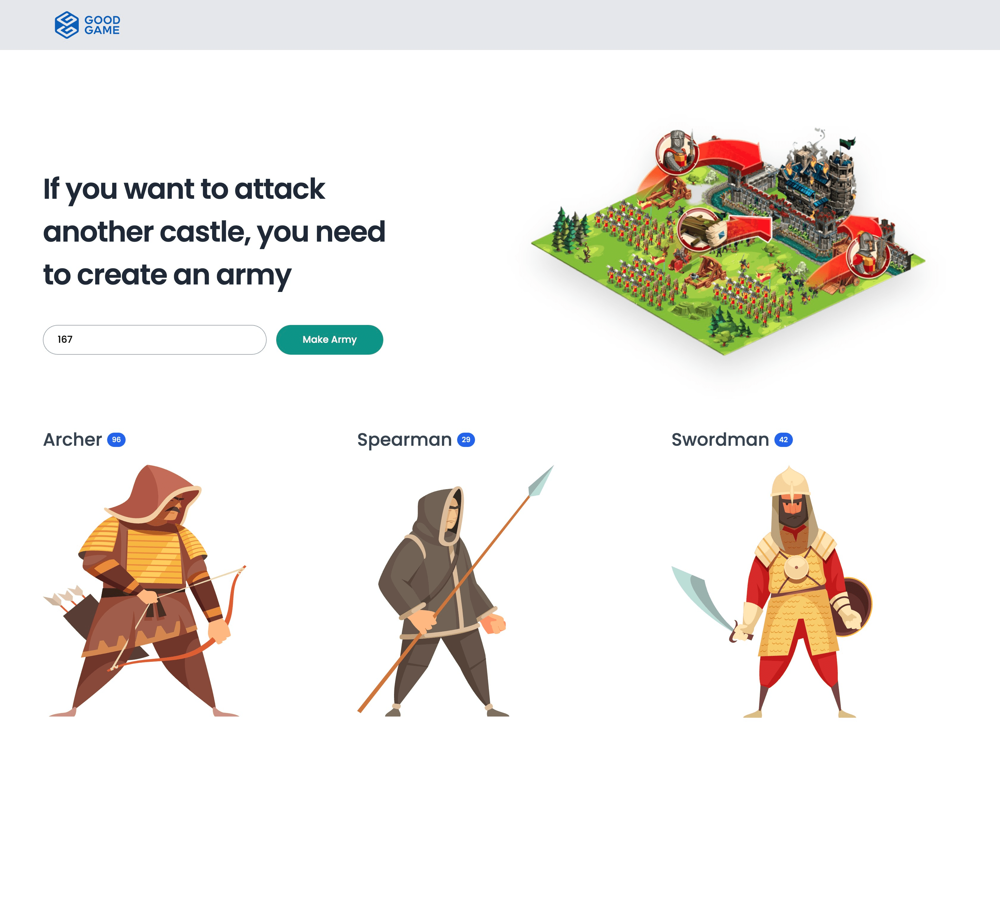

# Good Game Test



<p align="center">
This project
</p>

## 📝 Table of Contents

- [Problem Statement](#problem_statement)
- [Idea / Solution](#idea)
- [Dependencies / Limitations](#limitations)
- [Future Scope](#future_scope)
- [Setting up a local environment](#getting_started)
- [Usage](#usage)
- [Technology Stack](#tech_stack)
- [Contributing](../CONTRIBUTING.md)
- [Authors](#authors)
- [Acknowledgments](#acknowledgments)

## 🧐 Problem Statement <a name = "problem_statement"></a>

Every player in Empire has a castle. To let players attack another player’s castle, we need you to create armies of randomly
distributed troops (a troop is a formation of soldiers with the same skill, such as Spearmen, Swordsmen, Archers, etc.)
For example, we'll call your code telling it we need a random army that's 167 men strong. Assuming our available unit types to be,
for example, Spearmen, Swordsmen and Archers, what we want from you is that you tell us what such a random army would look
like.

, e.g.
Our Input: 167

Example result:
```
63 Spearmen

57 Swordsmen

47 Archers
```
## 💡 Idea / Solution <a name = "idea"></a>

I have used O(N) to acheive the above result.

## ⛓️ Prerequisites  <a name = "limitations"></a>
- lastet version of docker must be installed.
- docker and docker compose must be installed.
- if you want to use kubernets, skaffold need to be installed

## 🏁 Getting Started <a name = "getting_started"></a>

These instructions will get you a copy of the project up and running on your local machine for development
and testing purposes. See [deployment](#deployment) for notes on how to deploy the project on a live system.

### Prerequisites

- lastet version of docker must be installed.

- docker and docker compose must be installed.

- if you want to use kubernets, skaffold need to be installed

# Installing

You can use either `docker-compose` or  `Kubernetes` using `skaffold`

## 1 - docker-compose

- Development

  ```
  npm run docker:dev
  ```
- Test

  ```
  npm run docker:test
  ```
- Production
  ```
  npm run docker:prod
  ```

## 2 - Kubernetes

  ```
   skaffold dev
  ```

## 🎈 Usage <a name="usage"></a>

You can run the system using `docker-compose` or `skaffold`.

## ⛏️ Built With <a name = "tech_stack"></a>

- [Express](https://expressjs.com/) - Server Framework
- [Reactjs](https://vuejs.org/) - Web Framework
- [NodeJs](https://nodejs.org/en/) - Server Environment
- [Docker](https://nodejs.org/en/) - Server Environment
- [Docker Compose](https://nodejs.org/en/) - Server Environment
- [Kubernetes](https://nodejs.org/en/) - Server Environment
- [Skaffold](https://nodejs.org/en/) - Server Environment

## ✍️ Author <a name = "authors"></a>

- [@nimatrazmjo](https://github.com/nimatrazmjo) - Initial work